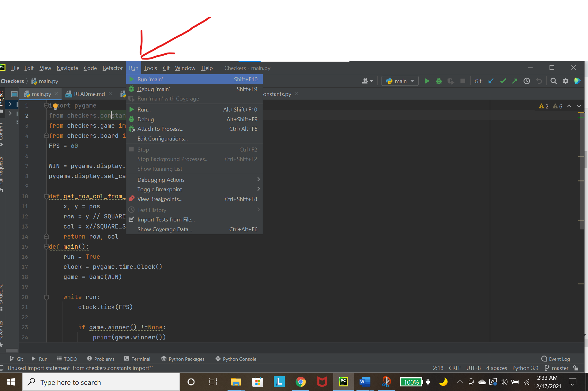
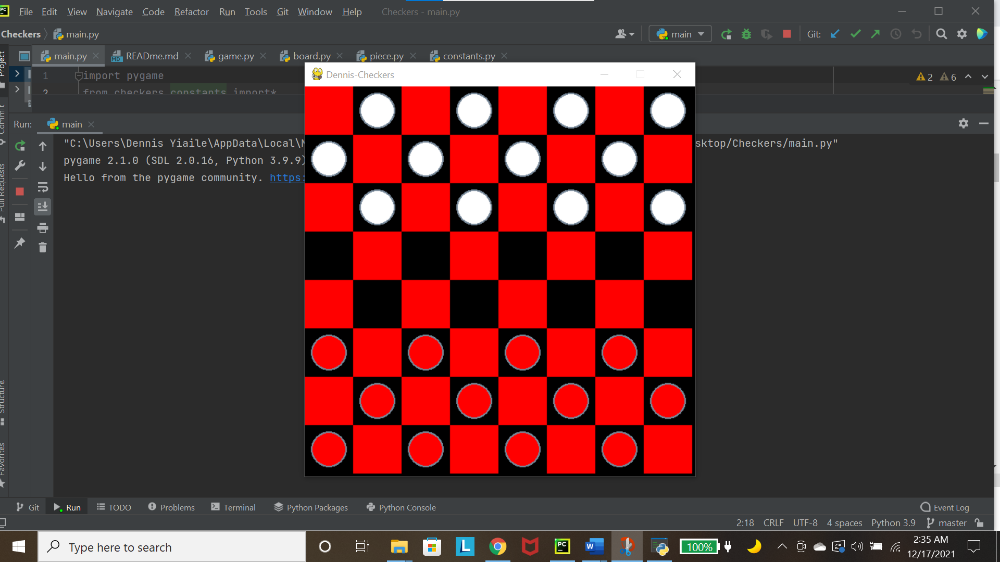
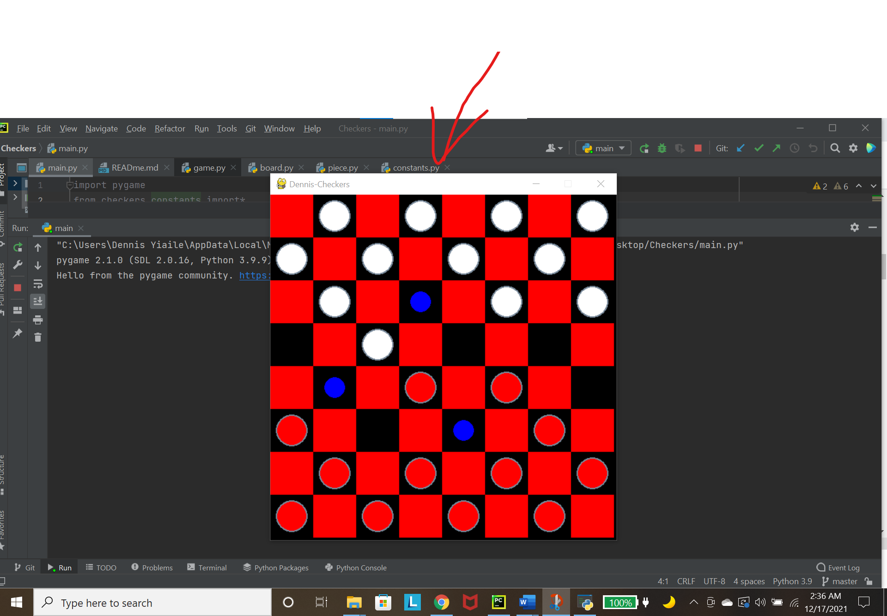
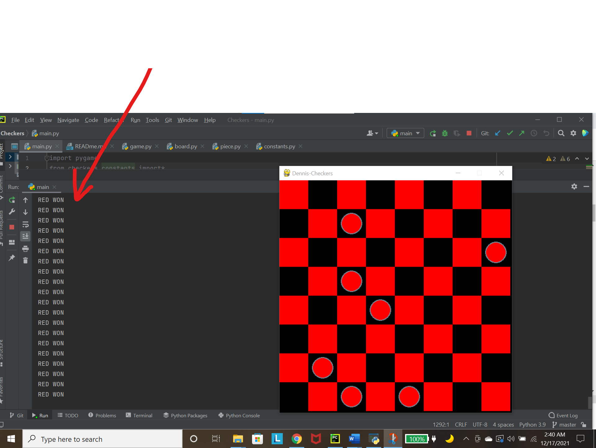

# DENNIS CHECKERS
### Two-Person Checkers Game, 12/17/2021.
### By [Dennis Yiaile](https://github.com/Dennis-tec)
### Github Url: https://github.com/Dennis-tec/checkers-game
## Description
#### Game was designed using Python and Pycharm framework. Opponents play against each other until one wins. Player wins if all the opponent's pieces get depleted
#### Image descriptions
#### Run to start: 
#### Can also run ```python3 main.py``` on the command line
#### Board: 
#### Players Movement: 
### Red player win: 
## Set Up Installation
* *Require a laptop or computer*
* *Can run best using pycharm or visual studio frameworks*
* *Access it via: ``git clone https://github.com/Dennis-tec/checkers-game.git``*
## Known Bugs
*None*
## Techlogies Used
* *Python*
* *Pycharm*
* *Visual Studio*


